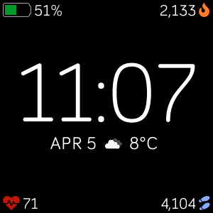

# Tokei



A clean digital Fitbit watchface with:

- 🔋Battery
- 🔥Calories
- 📅Date
- 💗Heart Rate
- 👣Step Count
- 🌡Temperature
- 🌤Weather

# Building

## OpenWeatherMap API

This app uses https://openweathermap.org/ API to drive the weather and temperature. Follow these steps:

1. Create an account and grab your API key from here: https://home.openweathermap.org/api_keys
1. Create a file in `common/secrets.ts`
1. Add the following text replacing `"xxx"` with your API key:

   ```javascript
   export const API_KEY = "xxx";
   ```
